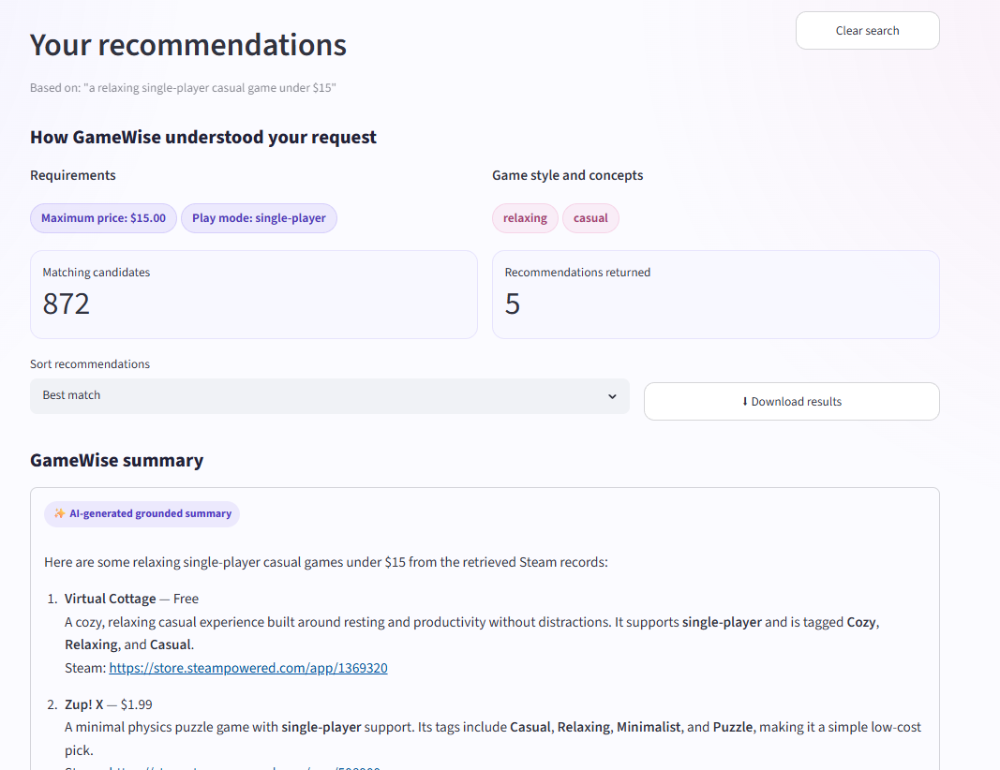
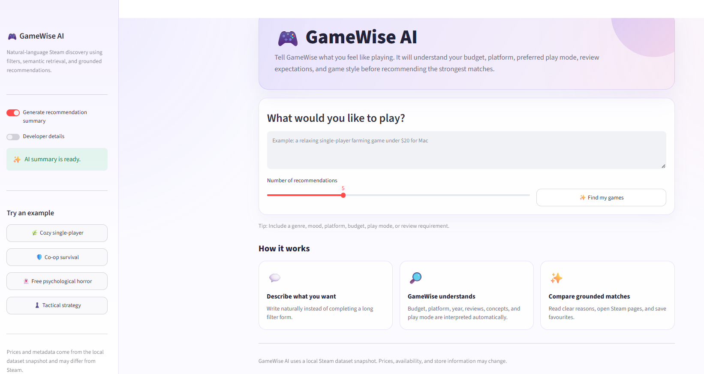
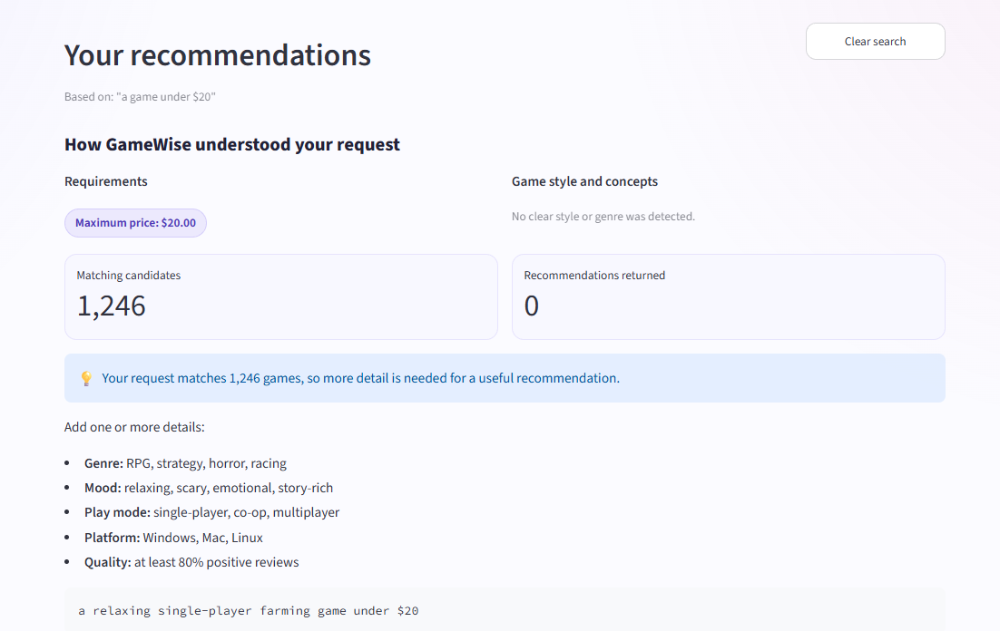
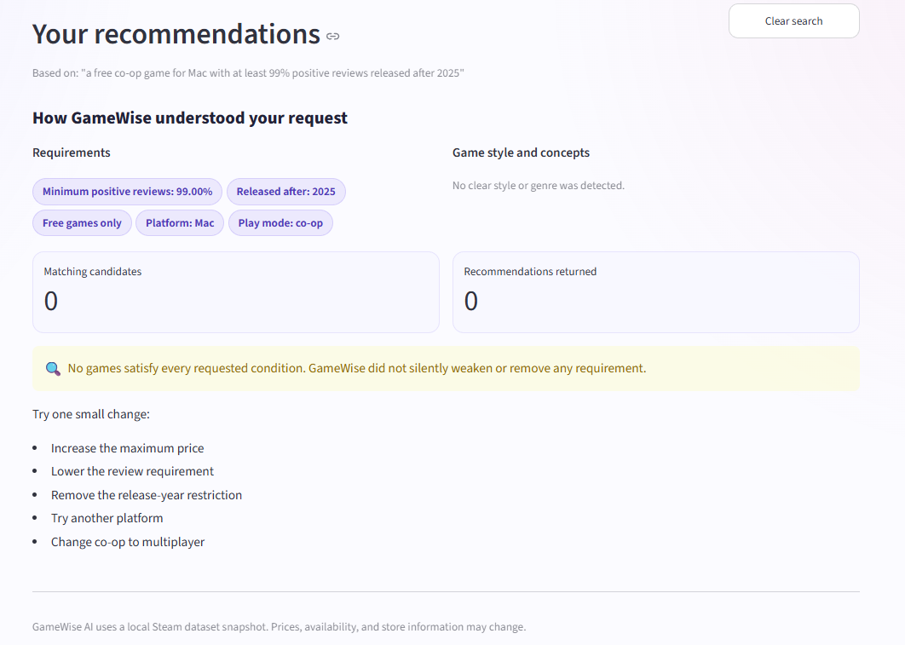

<div align="center">

# 🎮 GameWise AI

### Explainable Steam Game Recommendations from Natural-Language Queries

Describe the kind of game you want in everyday language.  
GameWise understands your budget, platform, review requirements, release year, play mode, genre, and preferred game style before returning grounded recommendations.

<br>


[](https://gamewise-ai.streamlit.app)
<br>

[Overview](#-overview) •
[Features](#-key-features) •
[Architecture](#️-system-architecture) •
[Evaluation](#-evaluation) •
[Installation](#️-installation) •
[Project Structure](#-project-structure)

</div>

---

## Portfolio Engineering Notes

This repository now includes additional engineering documentation:

- [Retrieval evaluation](docs/retrieval_evaluation.md)
- [Traditional Chinese extension plan](docs/traditional_chinese_extension.md)

These notes explain how the recommendation system is evaluated, how strict user constraints are preserved, and how the project can be extended toward Taiwan-market multilingual AI use cases.

---

## 🌐 Live Demo

Try GameWise AI directly in your browser:

### [🎮 Open GameWise AI](https://gamewise-ai.streamlit.app)

No local installation is required. Enter a natural-language game request to explore recommendations, clarification handling, shortlist features, and developer ranking details.

> The first semantic search may take longer while the embedding model is loaded.

---

## 📸 Application Preview



> GameWise converts a natural-language request into structured constraints, filters unsuitable games, ranks the remaining candidates, and explains why each recommendation matches.

---

## ✨ Overview

Finding a suitable Steam game can be difficult when a player has several preferences at the same time.

For example:

> A cooperative survival game under $20 with at least 80% positive reviews.

This request contains multiple requirements:

- The game must cost no more than `$20`
- The game must have at least `80%` positive reviews
- The game must officially support `co-op`
- The game should strongly relate to the `survival` concept

A normal keyword search may understand only part of the request.

GameWise processes the complete query using:

1. Natural-language query interpretation
2. Structured hard filtering
3. Sentence Transformer semantic retrieval
4. Field-aware concept scoring
5. Official play-mode validation
6. Review-quality scoring
7. Explainable hybrid ranking
8. Optional grounded recommendation generation

---

## 🎯 Project Objectives

GameWise was designed to:

- Understand natural-language game requests
- Preserve strict user requirements
- Go beyond basic keyword matching
- Provide transparent recommendation reasons
- Avoid inventing unsupported game information
- Handle broad and impossible requests safely
- Provide a polished and interactive user experience
- Remain usable without an external generation API

---

## 🚀 Key Features

| Feature | Description |
|---|---|
| 💬 Natural-language search | Users describe their ideal game without completing a long filter form |
| 💰 Budget filtering | Detects maximum price constraints such as `under $20` |
| ⭐ Review filtering | Supports minimum positive-review requirements |
| 💻 Platform filtering | Supports Windows, Mac, and Linux requirements |
| 📅 Release-year filtering | Supports queries using after, since, or before a year |
| 🆓 Free-game filtering | Detects free and free-to-play requirements |
| 🎮 Play-mode filtering | Uses official Steam categories for single-player, co-op, and multiplayer |
| 🧠 Semantic retrieval | Uses Sentence Transformer embeddings to understand related meanings |
| 🏷️ Concept matching | Matches genres, tags, categories, and descriptions using different evidence strengths |
| 🔀 Hybrid ranking | Combines semantic, concept, play-mode, and review-quality signals |
| 💡 Clarification handling | Broad requests ask for more information instead of returning random games |
| 🔍 Strict no-result handling | Requirements are never silently removed or weakened |
| ✨ Grounded summaries | Optional recommendation summaries use retrieved Steam records only |
| 🧩 Local fallback | The application works even when no OpenAI API key is available |
| 🕘 Search history | Recent searches appear immediately in the sidebar |
| 💜 Shortlist | Users can save games during the active Streamlit session |
| ↕️ Result sorting | Results can be sorted by match, reviews, price, or release year |
| ⬇️ CSV export | Displayed recommendations can be downloaded |
| 🛠️ Developer mode | Internal ranking details are available without cluttering the normal interface |

---

## 🖼️ Interface States

<table>
  <tr>
    <td width="50%" valign="top">
      <strong>Home page</strong>
      <br><br>
      
    </td>
    <td width="50%" valign="top">
      <strong>Clarification handling</strong>
      <br><br>
      
    </td>
  </tr>
  <tr>
    <td width="50%" valign="top">
      <strong>No-result handling</strong>
      <br><br>
      
    </td>
    <td width="50%" valign="top">
      <strong>Developer ranking details</strong>
      <br><br>
      
    </td>
  </tr>
</table>

---

## 🏗️ System Architecture

```text
┌─────────────────────────────────┐
│ Natural-language user request   │
└────────────────┬────────────────┘
                 │
                 ▼
┌─────────────────────────────────┐
│ Query interpretation            │
│                                 │
│ • Maximum price                 │
│ • Minimum review percentage     │
│ • Platform                      │
│ • Release year                  │
│ • Free status                   │
│ • Play mode                     │
│ • Requested concepts            │
└────────────────┬────────────────┘
                 │
                 ▼
┌─────────────────────────────────┐
│ Structured hard filtering       │
│                                 │
│ Remove games that violate any   │
│ explicit user requirement       │
└────────────────┬────────────────┘
                 │
                 ▼
┌─────────────────────────────────┐
│ Candidate game collection       │
└───────┬─────────┬─────────┬─────┘
        │         │         │
        ▼         ▼         ▼
 Semantic     Concept     Play-mode
 similarity  relevance    preference
        │         │         │
        └────┬────┴────┬────┘
             │         │
             ▼         ▼
       Review-quality signal
                 │
                 ▼
┌─────────────────────────────────┐
│ Hybrid ranking                  │
└────────────────┬────────────────┘
                 │
                 ▼
┌─────────────────────────────────┐
│ Top-k grounded Steam records    │
└────────────────┬────────────────┘
                 │
                 ▼
┌─────────────────────────────────┐
│ Recommendation explanation      │
│                                 │
│ • AI grounded summary           │
│ • Local fallback summary        │
│ • Per-game matching reasons     │
└────────────────┬────────────────┘
                 │
                 ▼
┌─────────────────────────────────┐
│ Interactive Streamlit interface │
└─────────────────────────────────┘
```

---

## 🔎 Retrieval Workflow

### Step 1 — Interpret the user query

Example query:

```text
a cooperative survival game under $20
with at least 80% positive reviews
```

Detected information:

```text
Maximum price: $20
Minimum positive reviews: 80%
Play mode: co-op
Requested concept: survival
```

The structured requirements are preserved throughout the retrieval process.

---

### Step 2 — Apply hard filters

Hard filters are mandatory conditions.

A game is removed before ranking when it violates a requested condition.

Examples include:

- Price exceeds the user's maximum budget
- Positive-review percentage is below the required threshold
- The requested platform is unsupported
- The release year does not satisfy the query
- A free game was requested but the game is paid
- Official Steam categories do not support the requested play mode

This prevents a semantically similar game from being recommended when it breaks an explicit requirement.

---

### Step 3 — Calculate semantic similarity

GameWise uses the following embedding model:

```text
sentence-transformers/all-MiniLM-L6-v2
```

The model converts both game metadata and user queries into 384-dimensional vectors.

Semantic retrieval helps connect related meanings even when the exact words are different.

Example:

```text
User query:
a cozy game to play alone

Related metadata:
relaxing, wholesome, casual, single-player
```

The Sentence Transformer model and processed search data are cached so they are loaded only once during each Python process.

---

### Step 4 — Calculate concept relevance

GameWise treats metadata fields differently.

| Metadata field | Evidence strength |
|---|---:|
| Genres | Strong |
| Community tags | Strong |
| Official Steam categories | Supporting |
| Short description | Weak |

This prevents incidental description wording from receiving the same score as explicit structured metadata.

Example:

```text
Game A tag:
Survival

Game B description:
Fight for survival in a realistic military battle
```

Game A receives stronger survival evidence because `Survival` appears as a formal tag.

Game B receives weaker evidence because the word only appears incidentally in its description.

### Supported concept groups

- Relaxing
- Casual
- Psychological horror
- Survival
- Open world
- Turn-based
- Tactical
- Strategy
- Adventure
- Puzzle
- Farming
- Simulation
- Story rich
- RPG
- Racing
- Shooter

---

### Step 5 — Validate play mode

GameWise uses official Steam categories to validate:

- Single-player
- Co-op
- Multiplayer
- PvP-related support

This allows the ranking system to distinguish between:

- A pure single-player experience
- A game supporting both solo and multiplayer
- A co-op game with strong PvP emphasis

Community tags are not used as the main source for official play-mode filtering.

---

### Step 6 — Add review quality

Positive-review percentage is converted into a normalized quality signal.

This signal does not replace relevance.

It helps prefer better-reviewed games when two candidates have similar semantic and concept relevance.

---

## 🧮 Hybrid Ranking

The final ranking formula changes according to the information contained in the query.

### Concept and play-mode query

```text
Hybrid score =
0.55 × normalized semantic similarity
+ 0.20 × concept relevance
+ 0.15 × play-mode preference
+ 0.10 × review quality
```

### Concept-only query

```text
Hybrid score =
0.65 × normalized semantic similarity
+ 0.25 × concept relevance
+ 0.10 × review quality
```

### Play-mode-only query

```text
Hybrid score =
0.70 × normalized semantic similarity
+ 0.20 × play-mode preference
+ 0.10 × review quality
```

### Other sufficiently specific queries

```text
Hybrid score =
0.90 × normalized semantic similarity
+ 0.10 × review quality
```

The normal interface converts internal ranking values into human-readable labels:

- Excellent match
- Strong match
- Good match
- Partial match

Raw values remain available through Developer mode.

---

## 💡 Query Safety and User Guidance

### Broad-query clarification

A broad query such as:

```text
a game under $20
```

may match hundreds of games.

Instead of returning arbitrary results, GameWise asks the user to provide more information, such as:

- Genre
- Mood
- Play mode
- Platform
- Review requirement

---

### Strict no-result handling

An impossible query such as:

```text
a free co-op game for Mac
with at least 99% positive reviews
released after 2025
```

returns a clear no-result message.

GameWise does not silently:

- Increase the budget
- Lower the review requirement
- Remove the platform requirement
- Ignore the release-year condition
- Replace co-op with multiplayer

This keeps the recommendation behaviour transparent.

---

## 🛡️ Grounded Recommendation Generation

After retrieval, GameWise can generate a recommendation summary using only the returned Steam records.

The generation layer is instructed not to invent:

- Prices
- Review percentages
- Review counts
- Platforms
- Release years
- Steam URLs
- Unsupported genres
- Unsupported gameplay features

### Generation modes

| Mode | Behaviour |
|---|---|
| AI-generated grounded summary | Uses the configured model with retrieved Steam records |
| Local grounded summary | Used when no API key is available |
| Local fallback after error | Used when an external generation request fails |

The retrieval system remains fully functional without an OpenAI API key.

---

## 📊 Evaluation

### Evaluation coverage

The retrieval pipeline was evaluated using 11 representative scenarios:

1. Cooperative survival
2. Relaxing single-player
3. Free psychological horror
4. Linux tactical strategy
5. Recent co-op adventure
6. Story-rich RPG
7. Windows racing
8. Mac farming simulation
9. Recent multiplayer shooter
10. Broad-query clarification
11. Impossible-condition handling

### Current evaluation results

| Metric | Result |
|---|---:|
| Expected search behaviour | **11 / 11 passed** |
| Hard-filter accuracy | **100%** |
| Valid-title rate | **100%** |
| Duplicate-free rate | **100%** |
| Metadata-term relevance@5 | **100%** |
| Automated tests | **16 passed** |

### Metric definitions

#### Expected search behaviour

Checks whether every evaluation case correctly:

- Returns recommendations
- Requests clarification
- Reports no matching results

#### Hard-filter accuracy

Measures whether every returned game satisfies every extracted structured constraint.

#### Valid-title rate

Checks that results do not contain:

- Blank names
- Missing values
- `Unknown`
- `Not available`
- Invalid placeholder titles

#### Duplicate-free rate

Checks that the same game title does not appear more than once in a single recommendation set.

#### Metadata-term relevance@5

Checks whether each top-five recommendation contains at least one separately defined relevance term in its genres, tags, or description.

> The evaluation results apply to the current 11 test cases and the selected 1,495-game dataset. They do not represent universal accuracy across the complete Steam catalogue or every possible user query.

### Evaluation files

```text
evaluation/evaluation_cases.json
evaluation/evaluation_results.csv
evaluation/evaluation_summary.md
```

---

## 🧪 Automated Testing

The project currently contains 16 automated tests.

The tests cover:

- Price extraction
- Review-percentage extraction
- Platform filtering
- Release-year filtering
- Official co-op filtering
- Clarification behaviour
- Invalid game-name filtering
- Embedding and metadata alignment
- Concept-scoring differences
- Description-only weak evidence
- Play-mode preference scoring
- Grounded generation fallback
- Empty-result generation behaviour

Run all tests:

```powershell
python -m pytest -q
```

Expected result:

```text
................
16 passed
```

---

## 🗂️ Dataset

The project uses a local dataset containing 1,495 Steam games.

### Available metadata

- Game name
- Price
- Free-to-play status
- Release year
- Positive review count
- Negative review count
- Positive-review percentage
- Genres
- Official Steam categories
- Community tags
- Supported platforms
- Short description
- Steam store URL

### Data-cleaning outputs

```text
data/processed/steam_games_cleaned.csv
data/processed/data_quality_report.json
```

### Embedding outputs

```text
data/processed/game_embeddings.npy
data/processed/game_embedding_index.csv
```

### Data-quality safeguards

The pipeline:

- Removes invalid game names
- Removes duplicate titles
- Preserves embedding-to-row alignment
- Safely converts numeric values
- Handles missing optional metadata
- Keeps hard filtering separate from ranking
- Prevents invalid results from reaching the UI

---

## 🧰 Technology Stack

| Area | Technology |
|---|---|
| Programming language | Python 3.13 |
| Web interface | Streamlit |
| Data processing | pandas and NumPy |
| Semantic embeddings | Sentence Transformers |
| Embedding model | all-MiniLM-L6-v2 |
| Machine-learning runtime | PyTorch |
| Testing | pytest |
| Optional generation | OpenAI API |
| Environment variables | python-dotenv |
| Version control | Git and GitHub |

---

## ⚙️ Installation

### Prerequisites

Install:

- Python
- Git
- Windows PowerShell, Terminal, or another command-line tool

---

### 1. Clone the repository

```powershell
git clone https://github.com/momo840505/gamewise-ai.git
cd gamewise-ai
```

---

### 2. Create a virtual environment

```powershell
python -m venv .venv
```

---

### 3. Activate the environment

#### Windows PowerShell

```powershell
Set-ExecutionPolicy -Scope Process -ExecutionPolicy Bypass
.\.venv\Scripts\Activate.ps1
```

#### macOS or Linux

```bash
source .venv/bin/activate
```

---

### 4. Upgrade pip

```powershell
python -m pip install --upgrade pip
```

---

### 5. Install project dependencies

```powershell
python -m pip install -r requirements.txt
```

---

### 6. Configure optional grounded generation

Copy the environment example:

```powershell
Copy-Item .env.example .env
```

Add local values to `.env`:

```text
OPENAI_API_KEY=
OPENAI_MODEL=
```

Important:

- Never commit `.env`
- Never publish a real API key
- The application works without an API key
- Without a key, GameWise uses its local grounded-summary fallback

---

## ▶️ Run the Application

From the project root:

```powershell
python -m streamlit run .\app.py
```

Open:

```text
http://localhost:8501
```

The first semantic query may be slower because the embedding model must be loaded.

Later searches reuse the cached model.

---

## 📈 Run the Evaluation

Run the evaluation as a Python module:

```powershell
python -m scripts.evaluate_retrieval
```

Do not run:

```text
python scripts/evaluate_retrieval.py
```

Using module mode ensures that imports such as `scripts.hybrid_search` are resolved correctly.

The evaluation produces:

```text
evaluation/evaluation_results.csv
evaluation/evaluation_summary.md
```

---

## 🧪 Example Queries

### Cooperative survival

```text
a cooperative survival game under $20
with at least 80% positive reviews
```

### Relaxing single-player

```text
a relaxing single-player casual game under $15
```

### Free psychological horror

```text
a free psychological horror game
```

### Tactical strategy for Linux

```text
a turn-based tactical strategy game under $20 for Linux
```

### Story-rich RPG

```text
a story-rich RPG with at least 90% positive reviews
```

### Broad query

```text
a game under $20
```

### Impossible query

```text
a free co-op game for Mac
with at least 99% positive reviews
released after 2025
```

---

## 📁 Project Structure

```text
gamewise-ai/
│
├── app.py
├── README.md
├── requirements.txt
├── .env.example
│
├── data/
│   ├── raw/
│   │   └── steam_top_games_2026.csv
│   │
│   └── processed/
│       ├── steam_games_cleaned.csv
│       ├── data_quality_report.json
│       ├── game_embeddings.npy
│       └── game_embedding_index.csv
│
├── docs/
│   └── images/
│       ├── home.png
│       ├── recommendations.png
│       ├── clarification.png
│       ├── no_results.png
│       └── developer_mode.png
│
├── evaluation/
│   ├── evaluation_cases.json
│   ├── evaluation_results.csv
│   └── evaluation_summary.md
│
├── scripts/
│   ├── build_embeddings.py
│   ├── clean_dataset.py
│   ├── evaluate_retrieval.py
│   ├── generate_answer.py
│   └── hybrid_search.py
│
└── tests/
    ├── test_generate_answer.py
    └── test_hybrid_search.py
```

---

## 🧭 Important Design Decisions

### Hard filters are applied before ranking

Explicit requirements are treated as mandatory.

A high semantic score cannot override:

- Price
- Review threshold
- Platform
- Release year
- Free requirement
- Official play mode

---

### Official categories are used for play mode

Single-player, co-op, multiplayer, and PvP support are verified using official Steam categories.

Community tags may contain noise and are not used as the main play-mode authority.

---

### Description text is weak evidence

Game descriptions provide useful context, but incidental words should not receive the same score as explicit genres or tags.

---

### No-result behaviour is transparent

GameWise reports that no game satisfies all conditions instead of silently relaxing the user's requirements.

---

### Explainability is included by default

Normal users see clear matching reasons.

Technical users can enable Developer mode to inspect:

- Hybrid score
- Semantic score
- Concept score
- Play-mode score
- Official Steam categories

---

### Expensive resources are cached

The embedding model and search data are loaded once per Python process.

This avoids loading the Sentence Transformer model again for every search.

---

## ⚠️ Limitations

- The dataset contains 1,495 selected Steam games rather than the complete Steam catalogue.
- Prices and availability reflect a dataset snapshot rather than live Steam information.
- Steam community tags may contain noisy or unexpected labels.
- Concept groups and term weights are manually defined.
- The system does not learn from personal gameplay history.
- Evaluation currently uses a limited predefined query collection.
- Metadata-term relevance is not a replacement for human relevance assessment.
- The first semantic search may take longer while the model loads.
- Search history and shortlist data currently exist only during the active Streamlit session.
- The system currently focuses on English queries.

---

## 🛣️ Development Roadmap

### Completed

- [x] Clean and validate the Steam dataset
- [x] Generate local game embeddings
- [x] Implement semantic retrieval
- [x] Add structured hard filters
- [x] Add field-aware concept scoring
- [x] Add official play-mode scoring
- [x] Add review-quality ranking
- [x] Add grounded recommendation summaries
- [x] Add local generation fallback
- [x] Add automated tests
- [x] Add formal retrieval evaluation
- [x] Build an interactive Streamlit interface
- [x] Add search history and shortlist
- [x] Add sorting and CSV export
- [x] Add Developer mode
- [x] Deploy the public Streamlit application

### Planned

- [ ] Retrieve live Steam prices and availability
- [ ] Add multilingual query support
- [ ] Add persistent user profiles
- [ ] Add persistent saved-game lists
- [ ] Add collaborative-filtering signals
- [ ] Add user feedback collection
- [ ] Expand evaluation with human relevance judgements
- [ ] Add side-by-side game comparison
- [ ] Add recommendation diversity controls

---

GitHub repository:

```text
https://github.com/momo840505/gamewise-ai
```

---

<div align="center">

Built with Python, Sentence Transformers, and Streamlit.

</div>
